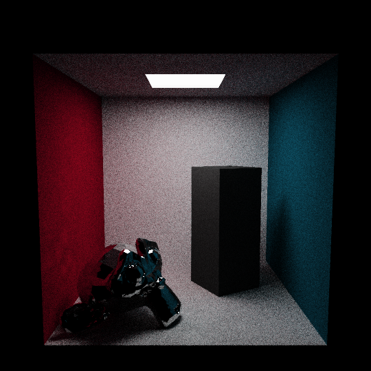

# squigly-trace
A cute ray tracer written in Haskell.



The goal of this project is to write an efficient raytracer that can handle
complex scenes. There are already a lot of C++ raytracers, so this one is in
Haskell instead. I hope this project will teach me a little about the dark art
of writing efficient Haskell programs.

May or may not currently be on hiatus.

Let me know if something is amiss. (In particular, it's terribly slow and I'm
kind of stuck on fixing that.)

# Building

You should have [stack](https://docs.haskellstack.org/en/stable/README/)
installed.

Clone the repo and run `stack build`.

# Running

Run `stack exec squigly-trace --` followed by whatever options you want. (The
`--` is important if you're running through stack!) Run `stack exec
squigly-trace -- --help` to see what options there are.

If no arguments are supplied, squigly-trace will look for .obj, .sq, and camera
files in `/data`.

Example usage: `stack exec squigly-trace -- -s 100 -p "~/scene.obj"` will parse
a scene from the file `scene.obj` in your home directory, and look there for any
.sq files referenced by `scene.obj`. After parsing, it will render the scene
with 100 samples per pixel.

# .sq file

squigly-trace reads .obj files as generated by Blender. Any mtl files referenced
by the .obj file are assumed to be in the same directory as the .obj file.  As
of right now, the commented headers must be manually removed in order to parse.
Also, materials are described using a special .sq file format. Each material
should have an entry that looks like this:

```
newmtl NAME
reflective REF R G B
emissive EM R G B
```

+ NAME is any string containing alphanumeric characters or . or _
+ REF indicates the degree of reflectiveness (0-1)
+ EM indicates the brightness of the emitted light (0-1)
+ R, G and B are the red, green, and blue components
+ RGB should be 0-1 for REF and can be any positive number for EM

squigly-trace doesn't use mtl files because that format is based on Phong
shading and this is a raytracer, hence only the diffuse color can be relevant
and the rest is just noise. My test models don't need many materials so it's
not too much work to just manually enter the material data.

# Resources

[scratchapixel](https://www.scratchapixel.com/) has a lot of information about
raytracers and computer graphics.
